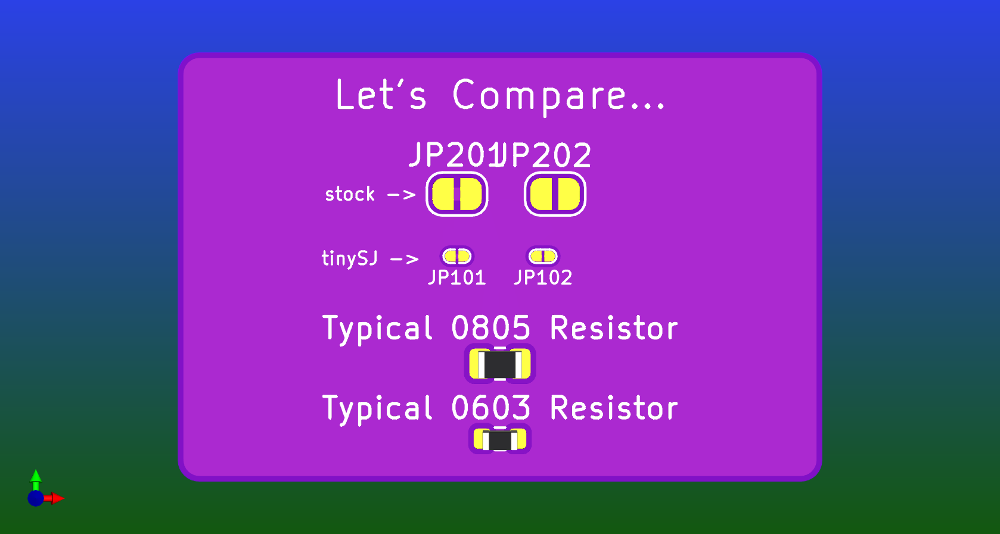

## A handy footprint for power output.

Allows for USB-A, USB-C or an XT30 connector.

USB-A includes the data lines so it will work for a QC source.

USB-C includes the data lines AND the CC & SBU lines so it will work for a QC or PD source. (as well as whatever the SBU pins are actually for... Closest I've managed to find to a useful description is as Agnd & Mic in "Audio Adapter Accessory Mode".)

> [!NOTE]
> the origin of this footprint is now where the centre line meets the board edge.

> [!TIP]
> You can select the model for 3D renders by going into the footprint properties after placing it on your PCB, selecting the "3d Models" tab & enabling whichever model you like.

## Solder Jumpers that actually fit.

The solder jumper footprints that come standard with KiCAD are handy, but massive.

These are not massive.

