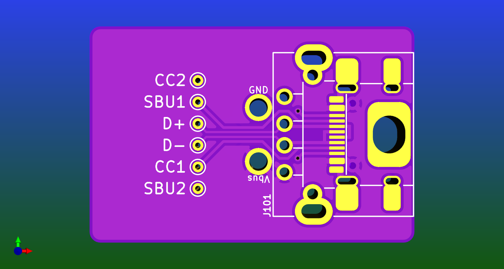
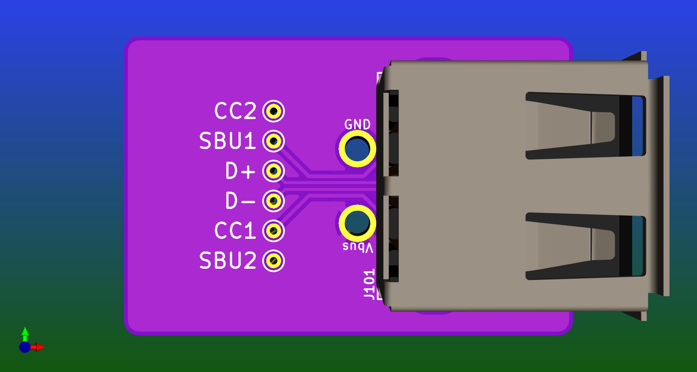
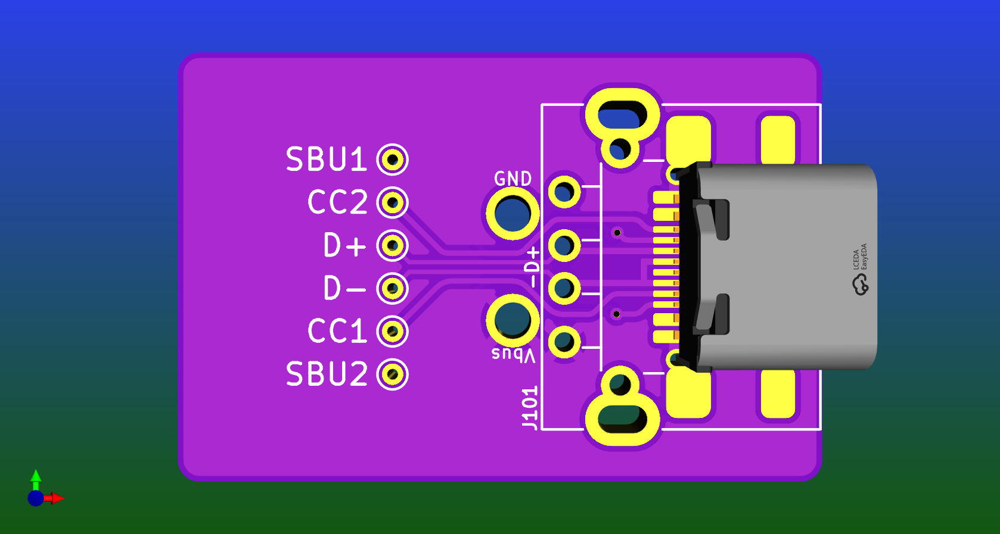
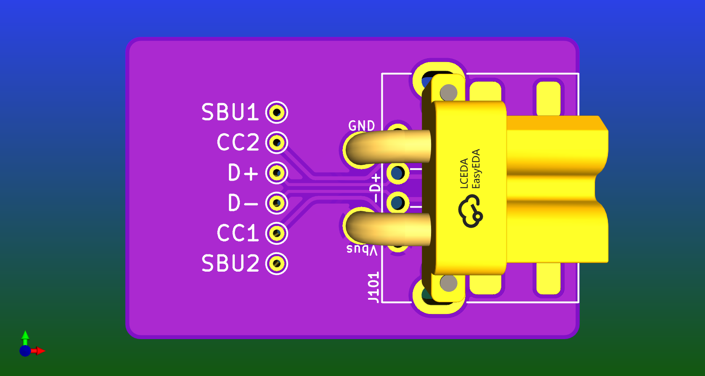

# A handy footprint for power output.

Allows for USB-A, USB-C or an XT30 connector.

USB-A includes the data lines so it will work for a QC source.

USB-C includes the data lines AND the CC & SBU lines so it will work for a QC or PD source.

